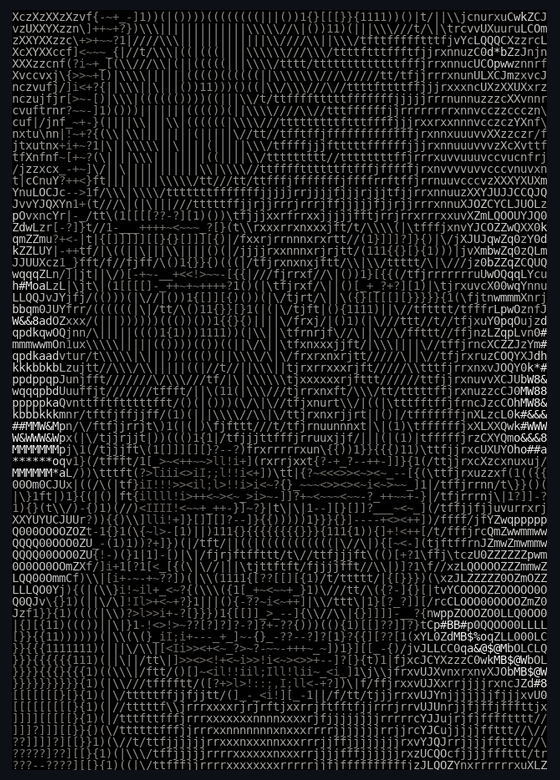

# Tehau DeBarthe

<!--
Architecture:
- Static asset: ./assets/tehau-ascii-face.png
- Editable profile text: everything below is normal README text/HTML and can be edited without regenerating the image.
- GitHub strips most custom CSS, so this uses GitHub-safe HTML + Markdown only.
-->

<table>
<tr>
<td width="34%" valign="top" align="center">



</td>
<td width="66%" valign="top">

<h1>tehau@enterprise-ai-os</h1>

```text
OS:........................ Enterprise AI Architecture
Uptime:.................... 15+ Years
Host:...................... Healthcare | Finance | Marketing | Chemical
Kernel:.................... Systems Thinking + Intelligent Automation
IDE:....................... VS Code | GitHub | Copilot | Azure AI Foundry

Languages.Programming:..... PowerShell, Python, JavaScript, SQL, C#
Languages.Platforms:....... Azure, M365, SharePoint, Dataverse, Fabric
Languages.AI:.............. Azure OpenAI, Copilot Studio, RAG, Agents
Languages.Human:........... Business, Technology, Governance

Hobbies.Software:.......... AI Frameworks, Agent Design, Evaluation Systems
Hobbies.Real:.............. Family, Learning, Building Useful Things

Contact.LinkedIn:.......... linkedin.com/in/tehau
Contact.GitHub:............ github.com/TehauDebarthe

Current.Role:.............. Enterprise AI Architect
Current.Mission:........... Reduce Administrative Burden Through AI

Signature.Systems:......... FORGE
Signature.Systems:......... MIMIR
Signature.Systems:......... CRUCIBLE
Signature.Systems:......... BIFROST

Career.Signal:............. Enterprise AI Strategy
Career.Signal:............. Healthcare Transformation
Career.Signal:............. Platform Governance
Career.Signal:............. Large-Scale Automation
Career.Signal:............. Agent Engineering

Impact:.................... Millions of Manual Interactions Eliminated
Impact:.................... Enterprise AI Governance Standards
Impact:.................... AI Champion Program Co-Founder
Impact:.................... Solutions Supporting 100k+ Users

North.Star:................ Care begins where automation ends.
```

<p align="center">
  <strong>Turning complex enterprise AI into reliable, reusable, governed systems.</strong>
</p>
