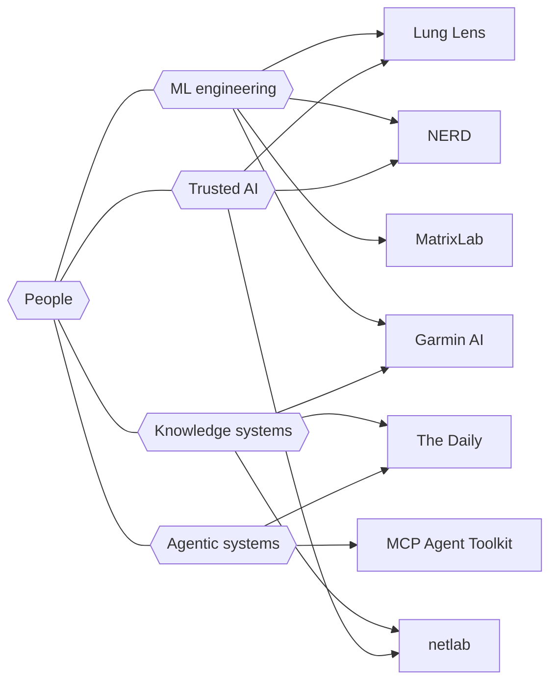

# Tehau DeBarthe

### Building intelligent healthcare systems.

*AI moves at the speed of trust.*

[LinkedIn](https://www.linkedin.com/in/tehau/) &nbsp;|&nbsp; [The Daily](https://thedaily.azurewebsites.net/) &nbsp;|&nbsp; [Repositories](https://github.com/TehauD?tab=repositories)

---

I’m Tehau, a machine learning engineer. I’m interested in how people, knowledge, and intelligent systems work together. Most days that means building AI, exploring new ideas, and trying to leave systems a little better than I found them.

This profile works like a public research notebook: the systems I’m building, the questions I’m chasing, and what I’m learning along the way. Personal perspectives, open questions, and project evidence are kept distinct, and nothing here presents institutional policy.

## What I explore

| Area | Focus |
| --- | --- |
| **Machine learning engineering** | Model development, evaluation, explainability, integration, and the surrounding software needed to make machine learning useful in real workflows. |
| **Agentic systems** | Tool-connected workflows with clear boundaries, observable behavior, and explicit opportunities for human review. |
| **Knowledge systems** | Knowledge graphs, organizational memory, retrieval, and interfaces that help information become usable context. |
| **Trusted AI** | Architecture and governance patterns that support transparent, reviewable, secure, and human-centered intelligent systems. |

## Selected systems

Each one starts with a question. Every link goes to public evidence.

| System | The question | Evidence |
| --- | --- | --- |
| **The Daily** Developer intelligence workspace | How can daily technical work become durable, connected knowledge without creating another administrative burden? | [Open the app](https://thedaily.azurewebsites.net/) [Repository](https://github.com/TehauD/daily) |
| **Lung Lens** Interpretability-first chest X-ray research | How can image classification outputs be made more inspectable? | [Repository](https://github.com/TehauD/lung-lens) |
| **NERD** Local-first decision runtime | Can small, bounded decisions be answered locally with probabilities, safety checks, and evidence instead of generated text? | [Repository](https://github.com/TehauD/nerd) |
| **MatrixLab** Computation research workbench | When two computations give the same result, how can the hidden choice that changes their cost become visible, measurable, and reproducible? | [Repository](https://github.com/TehauD/matrixlab) |
| **netlab** Local-first network analysis | What can a one-hop LinkedIn export honestly reveal when observed, derived, and inferred structure stay separate? | [Repository](https://github.com/TehauD/netlab) |
| **Garmin AI** Personal analytics pipeline | How can personal health and fitness data become more understandable while preserving context? | [Repository](https://github.com/TehauD/garmin-ai) |
| **MCP Agent Toolkit** Agentic systems infrastructure | How can intelligent systems connect to external tools through focused, reusable interfaces? | [MCP server template](https://github.com/TehauD/remote-mcp-server-authless) |

<b>How the pieces connect</b>

 

```mermaid
flowchart LR
    P{{People}}
    ML{{ML engineering}}
    AG{{Agentic systems}}
    KN{{Knowledge systems}}
    TR{{Trusted AI}}

    P --- ML
    P --- AG
    P --- KN
    P --- TR

    ML --> LL[Lung Lens]
    TR --> LL
    ML --> NE[NERD]
    TR --> NE
    ML --> MX[MatrixLab]
    KN --> NL[netlab]
    TR --> NL
    ML --> GA[Garmin AI]
    KN --> GA
    KN --> TD[The Daily]
    AG --> TD
    AG --> MCP[MCP Agent Toolkit]
```

- **The Daily:** a single-file, local-first workspace for structured capture, retrospectives, and versioned notes, with optional AI assistance.
- **Lung Lens:** a DenseNet-121 multi-label pipeline on CheXpert with Grad-CAM and Grad-CAM++ explanations. Research software only, not a medical device.
- **NERD:** yes/no, bounded-choice, and score decisions through ONNX Runtime or a deterministic NumPy fallback, with zero generated tokens.
- **MatrixLab:** matrix-chain planning compared against measured latency across NumPy, PyTorch CPU, and PyTorch CUDA.
- **netlab:** employer concentration, temporal bursts, and career-era segmentation, with every inferred quantity labeled as inferred.
- **Garmin AI:** Garmin Connect to InfluxDB, with non-diagnostic summaries from a local model.
- **MCP Agent Toolkit:** a remote Model Context Protocol server on Cloudflare Workers.

## Also building

Smaller, local-first tools for people outside of work.

| Project | What it is |
| --- | --- |
| [**WinterReady**](https://github.com/TehauD/winterready) | A winter storm and outage planner for households. Runs in the browser, works offline. |
| [**Rayla’s Creative Materials Lab**](https://github.com/TehauD/Rayla) | A creative studio for drawing, coloring, and material experiments. No ads, no accounts, no tracking. |
| [**HelloWorld**](https://github.com/TehauD/HelloWorld) | A starter platform for setting up an AI-ready development environment in minutes. |

## Working principles

> Personal working principles, not institutional positions.

- **Intelligence should amplify people.** Useful AI supports judgment, reduces avoidable friction, and gives people more room for meaningful work.
- **Trust is part of the architecture.** Clarity, accountability, security, and visible human control should be designed into the system from the beginning.
- **Claims should be inspectable.** Research questions, methods, limitations, and evidence should remain distinguishable from interpretation.
- **Knowledge should compound.** Good systems preserve context, connect learning over time, and make useful discoveries easier to revisit and share.

## Open questions

Things I’m still working out, not finished conclusions:

- How should an agent show its work when using tools, retrieving knowledge, or recommending an action?
- How can organizational memory remain useful without becoming another repository people stop maintaining?
- What makes AI trustworthy in healthcare workflows?
- How should evidence, uncertainty, accountability, privacy, and human judgment remain visible?
- Which decisions benefit from automation, and where should automation stop?

Thoughtful disagreement, relevant research, practical problems, and better questions are welcome.

<b>Experience path</b>

 

Most recent first:

1. **Machine Learning Engineer**
2. **Data Engineer Principal**
3. **DevOps Engineer II**
4. **Application Analyst II**
5. **Senior Solution Designer**
6. **Earlier SharePoint and systems roles**

## Say hello

If something here helps you think differently, solve a problem, or start a conversation, I’m delighted. If I can help, reach out.

- [Connect on LinkedIn](https://www.linkedin.com/in/tehau/)
- [Open The Daily](https://thedaily.azurewebsites.net/)
- [Browse my repositories](https://github.com/TehauD?tab=repositories)

Linked projects carry their own licenses. Metrics, dates, and outcomes appear only where they can be backed by public evidence.
